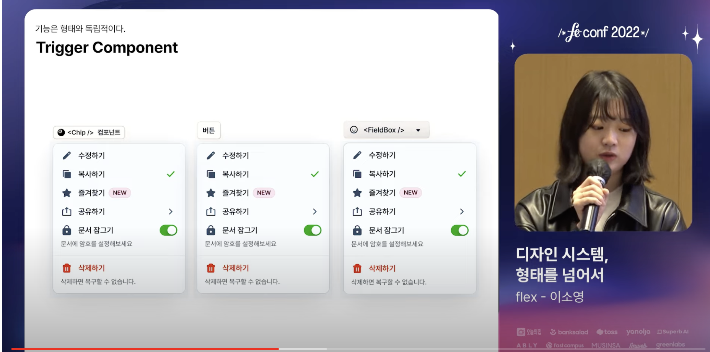

# 디자인 시스템, 형태를 넘어서

[디자인 시스템, 형태를 넘어서](https://www.youtube.com/watch?v=21eiJc90ggo)

<h2>디자인 시스템, 형태를 넘어서</h2>

## 발표 : flex - 이소영

예로 Select 컴포넌트를 만든다고 가정한다면, `스타일`, `형태`, `커스텀마이징 가능성`, `제약 사항` 4가지 주요 사항을 생각하고 만들어야 합니다.

### 스타일과 형태

- 스타일 : 컴포넌트 색상, 레이아웃, 무게감 같은 기본적 시각적 속성.
- 형태 : 컴포넌트가 사용자에게 보이는 모양새나 구조를 의미, Select 에서 컴포넌트의 드롭다운 모양, 옵션 표시 방식 등이 해당.

### 기능

컴포넌트가 수행해야 하는 동작을 말합니다, 예를 들면 스크롤, 선택된 아이템 표현, 키보드로의 탐색 등이 기능적 요소에 해당합니다.

### 접근성

모든 사용자가 컴포넌트를 원할하게 사용할 수 있도록 보장하는 요소. 예를 들어, 팝업 요소에 대한 시각적 힌트 제공, 키보드 탐색 가능성 등이 포함됩니다.

### 커스터마이징 가능성

다양한 사용 사례에 맞게 컴포넌트의 스타일, 형태, 기능을 쉽게 조정할 수 있는 능력을 의미, 이는 개발자가 특정 디자인이나 기능적 요구사항에 맞게 컴포넌트를 빠르고 쉽게 수정할 수 있도록 해줍니다.

#### 대응 방법

하나의 Select 컴포넌트를 계속 확장 : 필요에 따라 `새로운 기능을 추가`하면서, 하나의 컴포넌트의 계속 `확장`하는 방식, 이 방법은 디자인 시스템의 `복잡성을 증가`시키고 관리를 어렵게 할 수 있습니다.

여러 구현체로 나누기 : 각각의 요구 사항에 맞는 `여러 Select 컴포넌트`를 만드는 방식, 이는 구현체 간의 일관성을 유지하기 어렵게 하고, 코드베이스의 파편화를 초래 할 수 있습니다.

형태를 자유롭지 않으면 자유롭지만 형태를 매번 정의 해야 함. (Zag, React Aria -> 컴포넌트를 제공하는 것이 아니라 동작 Hook을 제공합니다.) -> 다소 비효율적

## Linear Design System (Principles)

- 원칙 : 컴포넌트가 수행하는 기능(동작)은 그 형태(스타일)와 `독립적`이어야 합니다.

- 의미 : 한 컴포넌트가 다양한 스타일이나 형태로 표현될 수 있음에도 불구하고,`그 기본적 기능은 변하지 않아야 합니다`. 예를 들어, 드롭다운이나, 셀렉트 컴포넌트는 다양하게 디자인될 수 있지만, `사용자가 옵션을 선택`하는 기능은 유지되어야 합니다.

### 기본 동작의 보장

- 원칙 : 모든 기본 기능은 보장되어야 함, 너무 많은 기본 기능은 사용처에서 불필요할 수 있고, 너무 적은 기본기능은 사용처마다 추가 작업을 요구할 수 있습니다.

- 의미 : 컴포넌트가 사용자가 기대하는 기본적 기능은 충분히 제공하면서도, 필요 없는 기능이 강제되지 않아야 합니다, 예를 들어, 모달 컴포넌트는 스크롤 영역을 기본으로 제공해야 하며, 선택 컴포넌트는 접근성을 고려하여 설계되어야 합니다.

Trigger Component 드롭다운, Select 컴포넌트 같이 일정 영역을 끄고 닫을 수 있는 컴포넌트.



#### 접근성

모달 설명하는 요소를 제공하고, 개발자가 신경써도 않아도, 스크린리더에서 제공해 줍니다.
Select 탐색 기능과 접근성 속성도 내부에 필요한 roll과 프로퍼티를 제공해주고 컴포넌트를 사용하기만 하는 방식으로 사용.


### 최소한의 제약

원칙 : 디자인 시스템은 최대한의 자유도를 보장하며, 디자이너와 개발자가 제약 없이 최고의 사용자 경험을 설계 할 수 있도록 지원해야 합니다.

의미 : 컴포넌트는 다양한 사용 사례와 디자인 요구사하을 수용할 수 있는 유연성을 가져야 합니다. 동시에, 일관성을 해치거나 사용성에 부정적인 영향을 미칠 수 있는 사항들에 대해서는 적절한 제약을 적용하여 균형을 맞춥니다.

## 소개한 Principle 설명하고 어떻게 구현했는 지

- Checkbox/Radio 컴포넌트 : 이 예에서는 체크박스와 라디오 버튼을 기본 형태가 있는 버전과 형태가 없는 `primitve` 버전을 나누어 제공, 기본 형태가 필요한 경우 `RadioGroup` 과 `RadioItem` 을 사용하고, 더 유연한 형태가 필요한 경우에는 `RadioGroupPrimitive` 을 사용합니다.

기본 형태가 필요한 경우, RadioGroup, RadioItem.

```javascript
<RadioGroup>
  <RadioGroup.Item />
  <Text>선택값 1</Text>
</RadioGroup>
```

다른 형태가 필요가 없는 경우, Primitive

```javascript
<RadioGroupPrimitive.Root>
  <RadioGroupPrimitive.Item>
    <Box>선택값 1</Box>
  </RadioGroupPrimitive.Item>
</RadioGroupPrimitive.Root>
```

### 컴포넌트 간 상호작용

이러한 컴포넌트는 내부적으로 Context API 를 통해 데이터와 상태를 공유합니다.
예를 들어, `Select` 컴포넌트는 `<SelectProvider>` 를 통해 내부 컴포너늩 간에 필요한 정보를 공유하며, 이를 통해 `Select.Content` 와 같은 컴포넌트는 `useSelect` 를 사용하여 상태를 관리합니다.

```javascript
<Select>
  <Select.Trigger />

  <Select.Content>
    <Select.Item />
    <Select.Group />
    <Select.Separator />
  </Select.Content>
</Select>
```

- 재사용성과 확장성 : 컴포넌트를 세분화하고 조합 가능하게 함으로, 다양한 UI 요소에 쉽게 재사용하고 필요에 따라 확장 가능합니다.

- 상태 공유의 효율성 : Context API 를 통한 상태 공유는 컴포넌트 간의 데이터 흐름을 명확하게 하고, 상태 관리를 효율적으로 할 수 있게 합니다.

## 정리

디자인 시스템을 만들 떄는 스타일, 형태, 기능, 접근성, 커스터마이징에 대해 고려 해 보고 만들어야 합니다.
주로 컴포넌트를 만들 때 Compound Component 을 사용해 내부 context 으로 데이터를 상호작용 하며, 효율적으로 컴포넌트를 작성했음.
